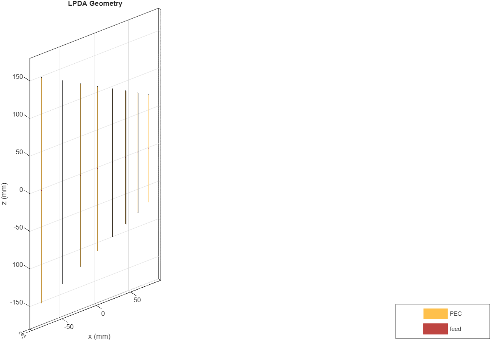
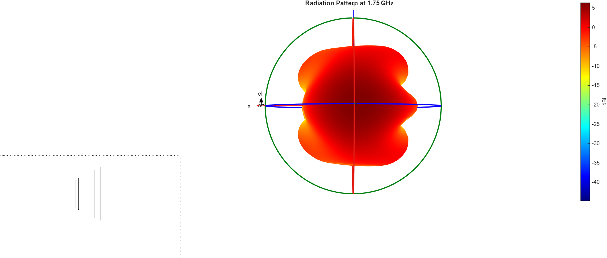
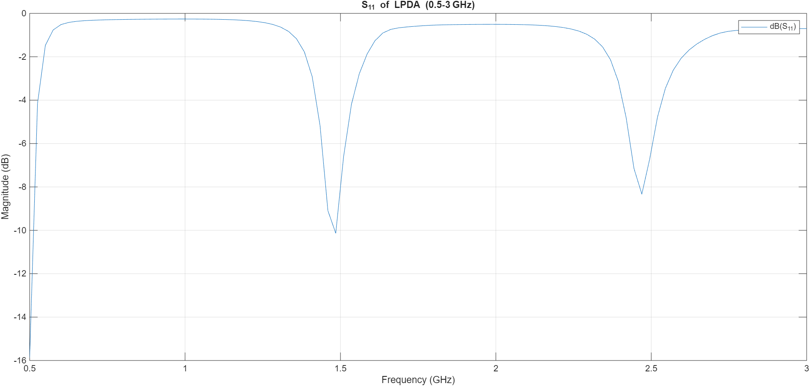
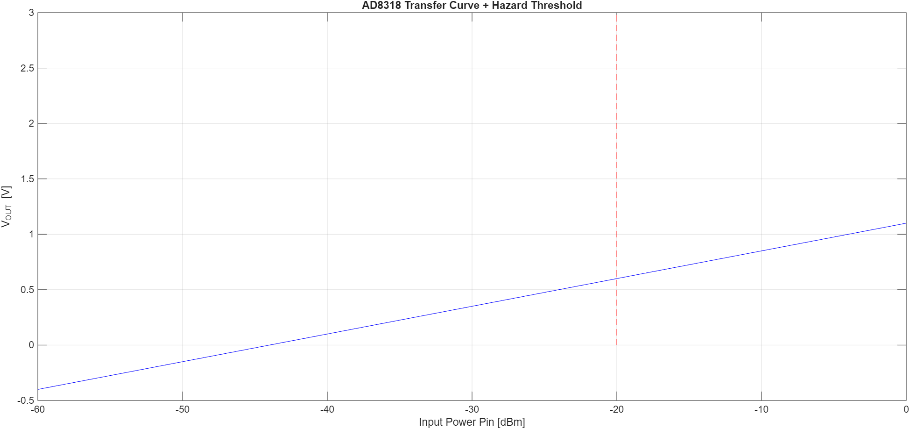

# Hazardous Electromagnetic Field (EMF) Detector

## 📌 Overview
This project simulates a **Hazardous EMF Detector** to detect dangerous electromagnetic fields in the **0.5 – 3 GHz** frequency range using MATLAB. The system is designed to:
* Detect EM waves in hazardous ranges.
* Trigger SMS alerts via Twilio when EM exposure is detected.
* Demonstrate antenna design and EM detection blocks in MATLAB.
* Serve as a prototype for real-world EMF safety monitoring and academic projects.

## 📂 Repository Structure

| File | Description |
| :--- | :--- |
| `antenna_design.m` | **Core Script:** MATLAB code for broadband antenna design and simulation. |
| `em_blocks.slx` | **Simulink Model:** Functional blocks for EMF detection logic. |
| `twilio_alert.m` | **Alert System:** Script for triggering SMS notifications via Twilio API. |
| `LPDA_geometry.png` | Visualization of the Log-Periodic Dipole Array antenna structure. |
| `Radiation_Pattern.png` | 3D radiation pattern showing antenna gain and directivity. |
| `s_parametre.png` | S11 (Return Loss) plot verifying the 0.5–3 GHz operating range. |
| `Transfer_curve.png` | Analysis of detector response versus field intensity. |

---

## 🧩 Tools & Libraries
* **MATLAB** (with Antenna Toolbox)
* **Twilio API** for SMS notifications
* **Simulated EM environment** for testing

## ⚙️ Features
* **Antenna Design:** MATLAB Antenna Toolbox used to design and simulate a broadband antenna targeting 0.5–3 GHz.
* **EM Detection:** Functional blocks detect hazardous EM waves within the target frequency range.
* **Alert System:** SMS notification sent via Twilio when EMF exceeds safety thresholds.
* **Simulation-Based Implementation:** System is fully simulated in MATLAB for demonstration purposes.

## ✅ Applications
* Hazardous EMF detection in labs or workplaces.
* Educational demonstration of EM wave detection and safety.
* Prototype for IoT-based EMF monitoring systems.

---
**Developed by [rohanasgowda](https://github.com/rohanasgowda)**
